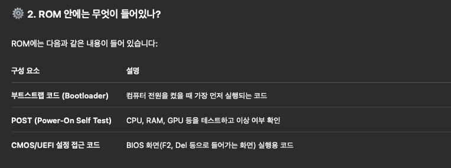

# EEP ROM 이란?
조사이유: ROM이라는 용어를 많이 들어봤음에도 생각보다 어디서 어떻게 쓰이는지  
혹은 어떤 일을하는지에 대해서는 생소하였고

비휘발성 읽기전용 메모리라고 한다.

사용 용도:
- 마이크로컨트롤러 (MCU): Arduino 같은 보드에서 설정값을 저장할 때 사용
- BIOS/UEFI: PC 부팅 시 사용하는 기본 설정 정보 저장
- 스마트 카드 / IoT 기기: ID, 설정값 저장

이런 용도가 있다고 하나 사실 현재 운체를 학습중이므로 살펴봐야할 주요 용도는 PC 부트스트랩 프로그램이(운체를 메모리에 올리는 프로그램)의 저장공간으로써의 역할이다.

-> 주로 펌웨어, 임베디드 시스템에 쓰인다고 한다.

### 물리적인 위치 혹은 포함 개념
물리적으로 메모리하면 일단 ram, 하드를 떠올린다.  
그래서 이중 어디있는 메모리지? 하고 찾아본결과 ROM은 물리적으로 마더보드에 납떔으로 박혀있는 칩들중 하나라고 한다.

결론적으로 IC(집적회로)인것은 동일한데 마더보드에 자글자글 박혀있는 칩중하나였다.

용량은 MB단위이며 (ex.8mb,16mb)

다음과 같이 아주 기본적인 펌웨어 같은것들이 탑재된다고 한다.

### 부트스트랩 관점에서 바라본 EEP ROM
CPU가 전원을 공급받고 꺠어자나자마자 가장 먼저 찾아가는 ROM이며 여기서 명령어들을 읽기 시작하는것이다.  
-> 부트스트랩도 단계가 있고 해당 기작이 1차 부트스트랩이라고 한다.

이후에는 다음과 이미지와 같은 과정을 거치는데 OS를 로드하는등의 2차 부트로더 부터는 디스크내 존재한다고 한다.  
-> 그래서 SSD에다가 운체깔아놓으면 부팅이 빨라지는구나?(신기함)

그래서 결국 rom내의 부트스트랩은 디스크,키보드 등 하드웨어를 연결해주는 역할을 한다.

### ROM을 직접 조작이 가능한가?
- 일반적인 사용자 입장에서는 BIOS 업데이트(= ROM 안의 펌웨어 업데이트) 정도만 가능합니다.
- 보통 메인보드 제조사에서 BIOS 업데이트용 툴을 제공합니다.
- FlashROM에 저장되어 있어서 펌웨어를 덮어쓰는 것은 가능하지만,
  - 실수하면 부팅이 안 될 수 있으므로 매우 조심해야 함

결국 뭐 제조사에서 뿌린 프로그램 업데이트 정도이지 직접 만지면 막 메모리,디스크 이런거 못찾아서 벽돌될수도 있다.  
-> 루팅하다가 벽돌되는게 이런 차원이다 -> 펌웨어(바이오스)를 건드리다가 그냥 하드웨어 자원조차 못찾는거다.