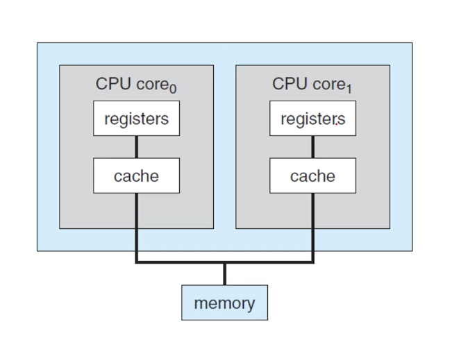

# 섹션 1
운영체제 실습환경 구축 이야기가 나온다.  
사실 이미 실무를 뛴다면 그냥 굳이 실습이 필요할까 싶어서 그냥 2배속으로 빠바박 들었다.(이거 할시간에 운동가야함)

WSL2: Windows Subsystem for Linux2  
생소해서 적어봤는데 윈도우에서 리눅스 개발환경 구축하는 이야기인가보다.(난 맥이라 더 필요없다)  

가상환경 구축 이야기이다.

심지어 요즘 이런거야 말로 claude 코드로 해줘 하면 끝나기 떄문에 뭐 딱히다(밥벌이나 더 공부하자)

걍 1강 생략

# 섹션 2
## 1강
항상 어떤 학문이던 정의를 곱씹어보면 정답이 나오는 경우가 많다.  
그만큼 학식이 높은사람들이 함축할려고 별의 별짓을 다한거니 당연할수밖에 없다(변수명 짓는것도 힘든데 얼마나 힘들었을까)  
그러니 좀더 곱씹어보며 살펴보자

### 운영체제
컴퓨터라는 (하드웨어)시스템을 운영하는 소프트웨어 -> 컴퓨터는 뭔데?

### 컴퓨터
스마트폰 vs 계산기  
컴퓨터는 정보를 처리하는 기계 -> 정보는 뭔데?  

밑에서 의식의 흐름으로 쭉갔다오는데 결국 범용적으로 처리할수 있는 연산  
- NOT, AND, OR 
- NAND
해당 연산으로 아무일이나 시킬수 있어서 소프트웨어에 의해 능력치가 결정되는 기계(걍 연산 조지게 하는 기계)  

### 정보
클로드 섀넌이라는 사람이 명확히 수학적으로 정의했다고함

정보량 관련 사항(이론적인 부분)

뭐 막 주사위로 경우의수 6가지인 상황의 수학적 정보량을 계산하고 그러는데 와닿지 않는다 전혀(실무에는 동떨어져보임)  
근데 이제 컴퓨터 관련 단위를 설명하는데 슬슬 들어본게 나온다.  
[단위]  
거리 단위는 1m, 무게단위는 1kg 처럼   

경우의 수가 2개라 해당 정보량 관련 수식의 P(x)가 1/2이 되는 정보단위를 bit 라고 한단다.  
정의는 그런데 이해안된다.  

걍 알쓸신잡으로 bit이 binary digit인거나 알고가야겠다.

정의: 불확실성을 측정해서 수치적으로 표현한것  

### 컴퓨터가 정보를 어떻게 처리하나요?
정보의 최소 단위: bit  
ex) 2bit -> 2^2 만큼 정보 표현가능  
8bit -> 2^8 만큼 정보 표현가능  

정보의 처리: 상태변환 0,1 사이 변환  

변환방법: 부울대수(NOT,AND,OR)  
-> 좀더 심화: 논리게이트(NOT,AND,OR,XOR,NAND,NOR)  
-> 논리게이트(트랜지스터 집적) -> 집적 회로들 IC,LSI    

뭔 논리회로, 컴퓨터구조, 자료구조 다섞인 강의느낌이다.  
뭔 양자 컴퓨터, 3진법 이야기까지 나온다.(너무 회로 집적 많이해서 이제는 한계에 도달 새로운 시도를 한단다)  

---

이런식으로 연산들을 조합해나가서 복잡한 일을 할수있다고 한다.  
덧셈 -> 뺄셈  -> 곱셈 -> 나눗셈 이런식으로  

뭔소리인줄 알겠는데 갑자기 go to 부터 어캐한겨 이런느낌 ㅋㅋㅋ  

### 범용컴퓨터가 돌아가기 위해 필요한 연산
- NOT,AND,OR 이거 세개만 있으면 됨
- NAND 만으로도 가능  
- 하드웨어 기술: NAND를 얼마나 조밀하게 촘촘히 쌓는가(그래서 낸드플래시가 맨날 나오는건가?)
 
### 컴퓨터가 할수있는가 없는가?
계산가능성
- 튜링머신으로 풀수있는것
- 튜링머신으로 못푸는것: 정지문제
gpt한테 물어보니까 뭐 나오는데 진짜 별걸 다알려준다.

### 프로그램이란?
프로그램의 정의: 명령어들의 집합이다. -> 하드웨어에게 특정 task를 실행시키는

### 운영체제란?
프로그램의 일종  -> 컴퓨터에서 항상 실행중인(유니버셜 튜링 머신) 프로그램  
하드웨어를 전체적으로 컨트롤 시스템의 기능을 어플리케이션에 제공  

창환 해석: 하드웨어 Wrapper 직접 하드웨어 다루려면 너무 복잡하니까, 뭐든 적당한 추상화된 결과물을 이용하니까  

관리대상: process, resource(파일,프린트,I/O), 유저 인터페이스  

개인적인 생각: 기존에 알고있던 컴퓨터의 자원을 관리하기는 커널 프로그램이라는 말이 더 와닿는다.  

강의에서 별걸 다 알려주고 교수님이 똑똑한거같은데 너무 많은정보를 쑤셔넣어서 오히려 안와닿는다.    
반효경 교수님의 강의가 조금더 쌈뽕하다.  

해당 섹션은 걍 교양으로 듣는게 맞는것 같다.  

## 2강
컴퓨터 시스템 구성
- 하나 이상의 cpu
- 여러개의 디바이스 컨트롤러 bus로 연결되어있는

### BootStrap이란?
진짜 닥터마틴 같은데 달려있는 부츠에 뒤쪽 천 스트랩이라고 한다.(실제임)   
발넣고 그거 떙겨서 신발 신는것처럼 파워를 넣고 컴퓨터를 키는 프로그램을 말한다고 한다.  
컴퓨터가 켜지자 마자 처음으로 실행해야할 명령어들을 지칭한다고 한다.  
-> 메모리에 운영체제를 로딩하는 일  

OS는 하드디스크에 저장되어있을테니 이것을 메모리에 적재해야한다(커널)  

컴퓨터 처음 키자마자는 휘발성이라 메모리에 아무것도 없다  
그래서 최초 명령어는 어딘가(ex.0x0번지) 이런 특정 주소나    
[EEP Rom](./EEP_ROM.md)으로 부터  불러온다고 한다.  

### Interrupts란?
하드웨어가 트리거 시키는 행위  
-> Cpu에 시그널을 시스템 버스를 이용해서 전달하는 행위(찌릿찌릿 플러팅)   

옛날에는 훨씬 복잡하게 배운거같은데 여기는 또 엄청 간단하게 넘어간다...  

### 메모리 계층구조
메모리는 가격, 속도에 따라서 계층을 쭉 나눠놓고 쓴다(비용적 문제)  

- register: cpu안에있는 개빠른거
- cache: Ram 보다는 빠름
- main Memery: RAM
- solid-state disk: ssd
- hard disk: 우리가 쓰는 하드
- optical disk: 광학 디스크(실제로 쓰나?)
- magentic tapes: 마그네틱 테이프 (금융권에서 실제 백업용도로 쓴다고 한다.)

### IO Structure
DMA 가 있어서 IO 기기끼리 통신도 가능하다.

예시: 유튜브 볼떄 cpu 딱히 연산할거 없음 네트워크 카드가 DMA로 직접 화면 송출하는 IO 쪽으로 내용쏨  

잡설: 요즘 운영체제가 새로워지는거는 IO 컨트롤러를 개발하는 일이 대부분 이다.  
커널은 이미 안정화 되어있다.(이미 너무오래 검증됨)  
신규 기기가 나오면  ex) 갤럭시 20 -> 21 새로운 하드웨어가 붙고 그럼 그 컨트롤러 만드는게 주요 OS 업데이트란다.(신기함)  

### 현재 컴퓨터 -> 멀티코어,멀티프로세서 등등 환경
#### SMP
Symmectric Multiprocessing   
모든 프로세서(CPU)가 동등한 권한과 역할을 가지는 구조  

대부분 이 구조를 채택 한다고  

여기서 이야기하고 싶은건 요즘 컴퓨터는 사실 cpu 여러개라는거다.  
(메모리는 하나임)  

#### AMP
Asymmetric Multiprocessing  
각 CPU가 고유의 역할을 가짐 (예: CPU1은 OS 실행, CPU2는 특정 작업만 수행 등)  

#### 멀티코어 디자인

cpu 자체를 여러개를 가져가면 비용이 너무 크니 cpu안에 핵심인 core(register,cache로 구성) 만 여러개로 가져가는 구조  

우리가 말하는 듀얼코어, 쿼드코어 이런게 이 구조라한다(cpu가 여러개는 아니였네!!!)  

이런 cpu 여러개가 붙으면 Mutli porcesser라고 한단다.  

### Multiprogramming
프로그램(프로세스) 동시에 여러개 돌리는거 -> cpu 사용율을 올림  

이거 안되면 그냥 dos다 하나 끝날떄까지 그냥 끈임 없이 기다리는 뭐 굳이 cpu사용율 이런걸 따질 필요도 없는것 같다 사용성 측면에서  

이렇게 동시에 돌아가는걸 Concurrency(동시성)이라고 부른다.  
뭐 동시성 병렬성은 코루틴 하면서 하루좽일 했으니(쾌락코딩 블로그가 제일 이해 잘됐던 펜하나 vs 펜2개 양손잡이) 넘어가도 된다.  

### cpu scheduling
멀티 프로그래밍을 할려면 필연적으로 따르는 문제  
-> cpu 효율을 올리는 방향으로 진행한다.  

어짜피 뒤쪽에서 주구장창 할거다.  

### Operation mode
User mode vs kernel mode  
일반적인 프로그램이 남의 프로그램 메모리 막접근하면 안되고 하드웨어도 갑자기 접근하면 안된다.  
(악성으로 갑자기 카메라 키고 이러면 안될것 아닌가?)  
유저 프로그램은 시스템콜을 이용해서 os 에서 제공하는 기능 접근  

### Virtualization(가상화)
운영체제를 여러개 돌리는거 -> VMM(virtual Machine Manager)을 이용 운체 여러개 돌림  
리눅스 가상으로 돌리고 뭐 이런거 실제로 예시가 있으니까 이해가간다.  

### [표준 라이브러리](표준%20라이브러리.md)
