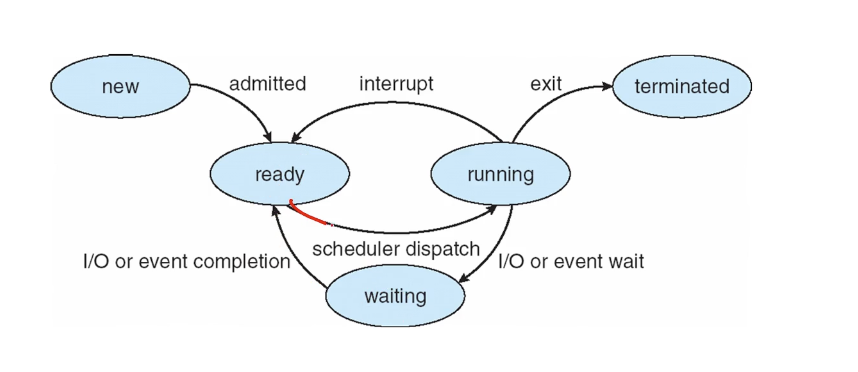

# Process에 대한 이해

프로세스 정의: 실행중인 프로그램  
운영체제 -> 프로그램을 실행시키는 프로그램

운영체제의 작업의 단위: 프로세스 

프로세스를 구성하는 섹션
- 텍스트 영역
  - 코드
- 데이터 영역
  - 전역변수
- 힙 영역
  - 동적 메모리 확보시(자바 new같은 키워드)
- 스택영역
  - 함수 호출시(파라미터,return 주소, 지역변수)

-> 메모리에 로드됐을떄 어떤형태로 로드되는지를 말하는것임

main.c -> gcc를 통한 컴파일 -> a.out라는 프로그램 -> 메모리에 올라갈시 프로세스 섹션구성으로 올라감

JVM환경에서는 개념적으로 구성이 거의 동일하나 살짝 다름

## process의 상태(생명주기)
- new
  - 프로세스가 방금 생성된 상태
- running
  - cpu 점유해서 명령 실행중인 상태
- waiting
  - cpu 점유하지 않은 상태로 대기하는 프로세스(IO를 기다리는 등)
- ready
  - 프로세스가 cpu만 받으면 바로 일할수 있게 ready상태 -> ready 큐에 들어가있음
- terminated
  - 모든것을 종료한 상태

막간 상식:  
ready 상태에서 cpu점유권을 주는 행위를(스케쥴러가) dispatch라고 한다고한다.  
-> 코틀린 코루틴의 dispatcher가 여기서 나온 네이밍이 아닐까 싶다.

## PCB(Process Control Block)
프로세스를 관리하는데 필요한 메모리 내용을 저장하는 구조체  
각 프로세스가 필요한 정보들을 들고 있음  

그 맨날 보는 이미지는 알아서 나중에 찾아보자

- Process state
- Progeam counter
- CPU register
- CPU scheduling information
- memory management infromation 
- accounting information
- I/O status information

이중 register 관련 값들을 context라고 지칭한다.
-> 실행 프로세스가 변경될떄 변경되어야하는 사항들
 

 ### 추가 학습 / 레지스터란?
 

-> 결론적으로 cpu 내부 자그마한 메모리

## 프로세스란?
갖은 설명을 해주시는데 오히려 햇갈리게 만들어서 그냥 내가 해석해서 적는다.  
-> 하나의(다수가 될수 있음/어떻게 개발했는가에 따라 다름) 실행 흐름으로 실행되는 명령어의 모음이다.   

(뜬금 없음 왜 설명하는지 모르겠음 )현대의 운영체제는 여러 프로세스가 동시에 실행되는 컨셉을 가지고 있다.  
-> 도스에서 하나만 실행되는거 요즘은 여러프로그램 켜놓을 수 있으니까  
이런 용어를 멀티 프로세싱, 멀티 태스킹 이라고 부른다고 한다.  

## 스레드란?
경량 프로세스 라고 설명한다.  
-> 경량이라는 말을 자주 사용하는데 마냥 좋은 설명 아닌것 같다.  

## 멀티 프로그래밍의 이유
cpu 사용을 극대화 시키기위해(cpu를 야무지게 사용하려고)  
-> 마냥 이런 이유는 아닌거 같은데 진짜 교수스러운 설명이다.  
사용자의 사용성측면이 더 크지 않을까 싶다. -> dos쓰던 엄마 이야기 들어보면 바로 와닿는다.  

## 시분할의 이유
유저에게 동시성처럼 보이게 하기위해  
맞는 말인데 더 많은 이유가 있지 않나 쩝...

## 스케쥴링 Queue 
ready Queue, IO Queue 이런 이야기가 나오는데 반효경 교수님 강의 내용이 더 알차다  
걍 흘러가듯이 듣고 나중에는 [예전 글](https://mccoy-devloper.tistory.com/78) 이걸 참고해야겠다.

## 컨텍스트 스위칭
알던 이야기 쭈르륵 늘어놓는다.
PCB 교환 이야기

## 프로세스 생성
 fork() 시스템 콜을 이용  
 프로세스 트리 형태를 구성 -> 부모 자식 프로세스가 있음  

### 프로세스의 실행 형태
- 실행 흐름
  - 부모 자식이 동시적으로 실행되는 형태
  - 부모가 자식 프로세스를 생성하고 자식 프로세스가 종료될떄까지 기다리는 형태
- 메모리
  - 같은 프로세스인데 분리만 되었다면 메모리에 code영역을 새로 잡을 필요없이 그대로 이용(pcb만 새롭게 구성)
  - 새로운 프로그램을 메모리에 로드

## 프로세스 종료
그냥 마지막 명령어 끝나면 종료이고
중간에 exit() 시스템 콜 호출해서 끝낼수있다. -> 코틀린에서는 exitProcess() 함수 / Java의 System.exit()호출해도됨

## 프로세스 종류(좀비와 고아)
강의 설명이 너무 별로라서 따로 찾아서 자료로 정리하려 한다.

## Fork()이후 다른 프로세스를 덮어쓰는 방법
execlp라는 명령어를 이용 다른 코드의 내용을 프로세스 코드내역에 덮어씀