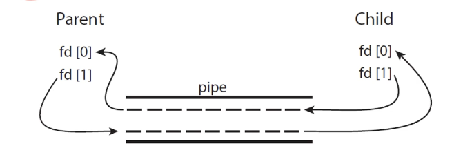

## 프로세스간 통신(IPC)
### IPC 란?
프로세스간 데이터를 주고 받는 행위

- shared memory -> 메모리에 공간을 확보 공유
- message passing -> 운영체제가 개입 메시지를 큐로 관리하며 전달

### 생산자 소비자 문제
가장 기본적인 형태의 두 개체의 협력방식  
-> 생산자 소비자 패턴 실제로 많이 쓰니까

### shared memory 
- 생산자와 소비자가 concurrently하게 일할수 있음
- 버퍼를두고 생산자는 버퍼를 채우고 소비자는 버퍼에서 가져가고
- 버퍼는 대부분 유한함 -> 정책이 필요

버퍼를 memory에 구성한다 보면됨

프로세스는 기본적으로 본인의 메모리에만 접근가능  
그래서 통신하는 프로세스가 서로 접근가능한 영역을 운영체제가 부여 및 관리  

C 코드로 써클러큐를 통한 구현예시를 보여주는데 이게 뭐 실제 코드도 아닐테고(책에도 동일하게 나와있긴함)  
이게 지금 나한테 의미가 있나 싶긴하다.

실질적인 문제
- 하나의 버퍼
- 여러개의 생산자
- 여러개의 소비자

이런 상황에서 결국 생산자 소비자를 응용프로그램에서 코드를 작성해서 사용해야하는데  
이런 방면에서 운영체제에 통신을 위임때려버리는 방법을 메시지 방식이라 볼 수 있다.  

- 사용예시
  - 운체 못믿는 불신론자(실제로 google에서 짠 코드를 믿어요? 이런말 들어봄)  
  - prosumer(생산자이자 소비자)가 복잡하게 연결되어있는 경우  

### Message-passing
두개의 추상화된 연산이 존재한다 (추상 자료형으로 바라보면 될듯)
- send(message)
- receive(message)

내부적으로 메시지 전달에 대한 복잡한 구현들은 운영체제에서 다 가져간 형태  

구현 방식의 대표적인 차이점  
- 직접(direct)/간접(indirect)
- 동기/비동기
- 자동(automatic)/명시적 버퍼링(explict buffering)

#### 직접 / 간접
[ 직접 ]  
어떤 프로세스와 통신할껀지 명시적으로 정해져있는  
링크를 둘사이에 직접적으로 형성  

[ 간접 ]  
전달을 mailbox,port 등 간접적인 매개체에 하는것  
같은 공유수단을 가질경우 링크 생성   

- os단에서 제공하는 기능
  - 메일박스 생성
  - send/receive
  - 메일박스 제거

해당 연산만 제공하면 통신 가능  

통신할때 port이야기도 이런 예시중 하나임 -> 통신 어짜피 다 운영체제 혹은 언어단에 추상화되어 있으니까  

명시적 인텐트 / 암시적 인텐트 느낌으로 생각하면 될것 같다.  

#### 동기 / 비동기
blocking IO vs nonBlocking IO  

예시  
보내려는 데이터 4g 버퍼사이즈 2g  
프로듀서 열심히 보내지만 한방에 다 못보냄 다 보낼때까지 blocking된다? -> blocking IO(send)  
send 명령 떄려놓고 continue로 다른일 계속하는것 보내는건 운체가 보장 -> nonBlocking IO(send)  

receive도 마찬가지  


## IPC 실제 예시
### 쉐어드 메모리 방식: POSIX(Portable Operating System Interface)
유닉스 계통의 표준화된 인터페이스라함 

Memory mapped files를 이용   
 -> 원래 파일 hdd공간에 잡는데 메모리에 잡아놓은거(겁나빠름)  

구현하는거 보면 Shared Preference같은 냄새도 좀나고(파일에 읽고쓴다)   
java에서 스트림 열어서 뭐 쓰고읽고 이런느낌도 살짝(이건 진짜 아주살짝)나고  
뭐 근데 사실상 구현자체는 상황맞춰서 하는거니까 나는 추상자료형만 잘익히면 구현은 뭐 상황맞춰서 하고 그리고 이런거 사실 이미  
안드로이드나 여타 프레임워크로 이미 한번 래핑되어있어서 이런 로우레벨까지 만질일이 없으니 그냥 참고용으로 공부한다.  

구현 간단요약:  
shm_open,ftuncate,mmap 함수를 통해서 공유 메모리를 구현  

gpt와 질답 요약  
```
Q:강의에 나오는 예제 코드는 os 내부 코드인가? 아님 개발자가 작성해야하는 코드인가?
A:개발자가 사용을 위해 직접 개발해야하는 코드이다.

Q:그럼 저 구현체에서 호출하는 함수들이 Posix 기준에 맞춰 OS단에서 시스템콜을 래핑하고 있는 함수들인가? 또한 헤당 함수들이 내부적으로 파일, mmap 등 os의 리소스에 대한 락처리등 복잡한 내용들이 숨겨져있는것인가?
A:맞다

Q:예제가 간단한 이유는 시스템 콜이 복잡한 구현들을 다 캡슐화하기 때문인가?
A:맞다
```


### 메시지 패싱: Pipes 
유닉스 초창기부터 사용된 IPC 매커니즘    
어떤 두개의 프로세스가 소통하는 도구    

- 파이프 구현시 고려 사항
  - unidriectional(일방적)/bidirectional(양방향)
  - two way communication -> half-duplex(반이중 통신:무전기) / full-duplex(전이중 통신:전화기)
  - relationship이 존재해야하는가? pipe의 경우 구현의 편의상 부모 자식 관계 형성
  - 네트워크 위에서도 이용가능한가?(안됨) 네트워크 위에서 구동가능한 파이프를 소켓이라 부름(소켓통신)

- 파이프의 종류
  - Ordinary pipes (단순한 파이프 강의에서 설명하는것)
  - Named pipes (고도화된 파이프 -> 부모자식 관계 필요없음)
 

 #### Ordinary Pipes
 
 
 해당 이미지 처럼 파이프 구성

 프로듀서 컨슈머 형식으로 소통  
 유니다이렉션한 pipe로 두개를 구성하여 양방향 통신을 구현  

 unix에 Pipe라는 시스템 콜이있다.  
 -> 인자로 사이즈 2짜리 배열 -> read end / write end 넣어줌(프로세스 두개)  

 이걸로 실제 구현함  
 
 여기서 실제 제시되는 코드도 pipe사용을 위해 개발자가 직접 작성할 코드  
 즉 결국 Pipe를 제공하는게 운체의 역할 -> Pipe()시스템 콜 제공   

 근데 체감상 지금 예시 두개만 보면 복잡도는 거기서 거기임  


 #### 개인적인 소감
 시스템 콜 자체로 IPC 하는건 별로 복잡하지 않은데 안드로이드에서는 구현체로 둘둘싸서 오히려 어려운느낌  
 겸사겸사 이번에 안드로이드에서의 IPC하는방법을 좀더 파볼예정(기존에도 궁금함 -> 한캐에 프로세스 분리 도입하자 제시했었음)  


### 소켓
네트워크 통신이 이런식으로 프로세스간 통신관점으로 바라보는 시각은 첨봤음 난 몰랐음   
그냥 네트워크 통신은 네트워크고 IPC는 다른 카테고리라 생각했는데 네트워크에 올라와있는 다른 컴퓨터의 프로세스와 통신하는 기법 자체를 소켓이라고 한다함  

정의: 통신을 위한 각 엔트포인트를 지정하는 방법  
-> 엔드 포인트 어떻게 지정함?(네트워크 이야기)  

- 컴퓨터 어떻게 특정?: IP주소  
- 프로세스 파이프를 어떻게 특정?: port번호  

소켓: IP주소랑 포트번호 묶은거 -> 네트워크상에 프로세스 특정가능  

컴퓨터 사양이 다르면 통신 어떻게함?  
ex)a는 32bit big Endian b는 64bit little Endian  
-> 그래서 전문에 어떤식으로 보낼지 다 적는 뻘짓을 계속했다고  
ex)4바이트는 리틀엔디안, 다음 16바이트는 스트링 이런식으로 뭘 보낼지 다 지정했다고  

### RPC(Remote Procedure Calls)
직역: 원격 함수 호출  
사양 다른 컴퓨터 끼리 통신의 문제점을 해결하기 위해 나온것  

네트워크 상의 프로세스 간의 함수를 추상화  
-> 걍 프로토콜 아님?  

자바에서는 RPC를 RMI(Remote Method Invocation)으로 구현했다고 한다.  
마이크로 소프트 원도우즈 모델에서는 COM(Component Object Model)로 구현  
뭐 쩄든 구현체들이 있다고한다.  
-> 고급 엔터프라이즈 환경에서 많이쓴다고  

- RPC 내 용어
  - stub: 함수 인터페이스 목록(클라이언트에서 받는)  
  - marshals: 각 컴퓨터의 사양에 맞게 파라미터를 변환하는 행위(객체 직렬화,엔디안 맞추기)  


### 역사
자바가 인터넷,소켓을 아주 쉽게 쓸 수 있도록 언어단에서 추상화 인터페이스를 제공 해줬다고함  
-> ㅋㅋㅋ 근데 우리는 이것도 다 라이브러리 씀(나중에 라이브러리 만들어봐야겠다/ 근데 square에서 만든 시리즈는 너무 방대한데)  

자바에서 제공하는 소켓 타입
- Socket(TCP)
- DatagramSocket(UDP)
- MulticastSocket(소켓통신에 쓰는 특정 목표에 브로드캐스트 하는소켓)

-> 소켓 프로그래밍 예제 레포 당장 판다  
자바로 예시 코드있는데 그건 안들었다. 그리고 코틀린으로 짤꺼임 ㅋㅋㅋ(자바싫어)  

