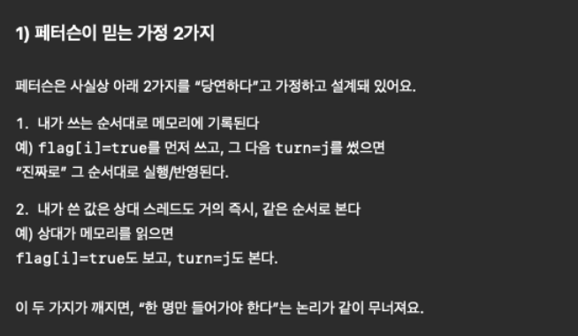

# 6장 동기화 도구들

병렬적으로 코드가 돌아갈때 왜 동시성 문제가 터지는지 설명하는데  
사실 그냥 c언어로만 써놔도 뭐가 문제라는거야 싶을 수 있는데 책에 나와있는 예시를 보면 바로 아하!! 하고 이해할수 있다.  

이러한 문제가 발생하는 이유는 고수준의 언어는 저수준의 언어나 연산을 겹쳐서 동작시키는데  
시분할에서 cpu를 뺏기는 단위가 고수준 언어의 연산단위가 아니기 때문이다.  

책의 예시로 고수준 언어의 연산은 기계어로 다음과 같이 분리된다.  
```
count++ 

register1 = count
register1 = register1 + 1
count = register1
```

```
count-- 

register2 = count
register2 = register2 - 1
count = register2
```
이제 이 count++이랑 count-- 가 병행하게 실행되면 저수준 연산이 랜덤하게 뒤섞여서 실행되는것과 같다.

```
예시
register1 = count           [register1 = 5]
register1 = register1 + 1   [register1 = 6]
register2 = count           [register2 = 5]
register2 = register2 - 1   [register2 = 4]
count = register1           [count = 6]
count = register2           [count = 4]
```
우리가 상식적으로 생각했을때 5나와야하는 값이 6이나 4로 랜덤하게 나올수있다.

이런식으로 자원에 동시에 접근하는 상황을 race condition이라고하고 이를 막기위한 방법을 학습한다.

## 임계 구역
임계 구역은 동시성 문제를 설명하기 위한 개념이라고 보면 된다.

정의: 적어도 하나 이상의 다른 프로세스와 공유하는 데이터에 접근하고 갱신할 수 있는 코드 영역

결국 동시성 문제를 잡으려면 임계구역에 하나의 프로세스만 진입할 수 있도록 조치를 취해야한다.

임계구역을 나누는 용어
- 진입 구역(임계 구역 진입점)
- 퇴출 구역(임계 구역 탈출지점)
- 나머지 구역(임계 구역이 아닌 구역)

임계구역 문제는 다음과 같은 기준을 가지고 문제를 바라봐야한다.
- 상호 배제
  - 하나의 프로세스만 그 구역 실행
- 진행
  - 임계구역에 주인이 없는 상황에서 나머지 구역 코드를 실행하지 않고있는 프로세스들 중 임계 구역에 진입하려는 애들중 진입할 프로세스 선택
  - 이 선택은 무한정 연기 불가
- 한정된 대기
  - 프로세스가 임계구역 들어가겠다고 요청후 다른 프로세스가 그 임계구역을 차지하는 횟수에 한계가 존재해야한다.


임계 구역 관련 잡설
-  커널코드에서 race condition 많이 일어난다.
-  단일 코어 환경에서는 공유 변수 수정시 인터럽트를 막아서 임계구역 문제를 해결할 수 있다.
-  다중 처리기에서는 위 방법이 안먹힌다. -> 다중처리기에서 인터럽트 막으면 비용이 클 수 있다.
-  운영체제에서 선점형 커널 / 비선점형 커널 으로 바라볼 수 있다.
-  비선점형 커널은 커널에서 프로세스는 하나만 실행하기 떄문에 커널 자료구조 race condition에서 자유롭다.
-  비선점형에서는 커널 자료구조 race condition이 없다고 보장못해서 신중하게 설계되어야한다.


## Peterson의 해결안
가장 간단한 임계구역 문제를 해결한 알고리즘  
하드웨어 지원이 아닌 소프트웨어만으로 문제를 해결하려는 시도에 의의가 있음(실제로 적용은 불가)  
하지만 현대적인 아키텍처에서는 무력화된다. -> 학습용으로 이용  

[ 핵심 한줄요약 ]
>“나 들어가고 싶어”라고 표시하고,
충돌하면 상대에게 양보(turn)해서 한 명만 들어가게 한다

[ 구현 방법 ]
변수 2개로 구현
- flag[2]
- turn

[ 알고리즘 전체 구조 (의사 코드) ]
```
flag[i] = true        // 나 들어갈게
turn = j             // 혹시 겹치면 너 먼저 해
while (flag[j] && turn == j) {
    // 기다림 (busy wait)
}

// ===== 임계 구역 =====

// 임계 구역 끝
flag[i] = false
```

[ 둘다 들어가려는 경우 어떻게 동작하는가? ]  

Thread 0:  
```
flag[0] = true
turn = 1
```
Thread 1:
```
flag[1] = true
turn = 0
```

 둘 다 while 문을 검사

Thread 0의 while
```
flag[1] == true
turn == 1 ?   // ❌ (turn은 0)
```
→ false → Thread 0 진입

Thread 1의 while
```
flag[0] == true
turn == 0 ?   // ✅
```
→ true → Thread 1 대기

🔑 핵심 포인트
- 마지막에 turn을 쓴 쪽이 양보
- turn 하나로 충돌을 해결


임계구역 해결 방법 기준 확인
- 상호배제: 만족
-  진행: 한턴씩 무조건 서로 진입하기떄문에 만족
- 한정된 대기: 한턴씩 돌아감으로 만족
<details>
<summary>최신 아키텍처에서 해당 알고리즘이 안먹히는 이유</summary>



상기 이미지의 가정이 그래서 어떻게 꺠지는가를 살펴보자  

[관점을 멀티코어로]  
일단 시야를 멀티코어 관점으로 바라봐야한다.  
-> 여태까지 학습에있어서 싱글코어 관점으로 바라봤기 때문에 자꾸 되짚어볼때 싱글코어 환경으로 생각한다.  

멀티코어 환경에서는 시분할에 의해 순서가 빠르게 바뀌는게 아니라 그냥 진짜 동시에 일어나며  
레지스터들도 각각 코어별로 다르기에 메모리 가시성을 고려해야한다.  

[순서 변경으로 인한 문제]  
책에나오는 그림 6.4를 보면 예시가 될 수 있다.  
논리적으로 엄청 헷갈리고 사실 gpt는 피터슨이 깨지는게 아니라 진입시점이 엇갈렸다고 피터슨이 꺠진거는 아니라는데  
gpt가 헛소리하는거 같은게 임계구역에 애초에 두 실행흐름이 들어간게 깨진거지 뭘 자꾸 이상한 소리를 하는지 모르겠다.  
  
[메모리 가시성 문제 -> 멀티코어 환경은 메모리 관리 단위를 각각 가진다.]  
> CPU에서 flag[i] = true 는 한 동작이 아니다  
> 이 한 줄은 실제로 이렇게 쪼개집니다.  
> ```
> 1) 레지스터에 값 준비
> 2) store buffer에 기록
> 3) (나중에) cache line에 반영
> 4) (더 나중에) 다른 코어에 전파
> ```

근데 여기서 멀티코어라 레지스터, store buffer 다 코어별로 독립적으로 사용된다.

```
[Core 0]                [Core 1]
  |                       |
  ├─ Store Buffer 0       ├─ Store Buffer 1
  ├─ L1 Cache             ├─ L1 Cache
  └─ L2 Cache             └─ L2 Cache
          \                 /
           \               /
            [Shared L3 Cache]
                   |
            [Main Memory]
```

그래서 쓰기를 진행할때 store buffer에 쓰고 다시 다음 명령어를 실행하지만  
store buffer까지만 쓰였을때 다른 코어에서는 값이 바뀐것 자체를 못볼수 있다.  
-> 내 코어에서는 바뀌었는데 다른 코어는 값이 안바뀜  

참고: 쓰기 연산의 순서  
>쓰기(write)는
>store buffer → (내 코어의) 캐시 → 캐시 일관성 전파 → (필요 시) 메인 메모리
>순서로 진행되고,
>다른 코어가 “보기 시작하는 시점”은
>메인 메모리가 아니라 ‘캐시 일관성 프로토콜이 개입한 순간’이다.

쓰기 한 번 (flag = true) 이 실제로 지나가는 경로:  
1.레지스터
- CPU가 연산 결과를 레지스터에 준비
- 아직 메모리 계층에는 아무 변화 없음

2.Store Buffer (코어 전용)
- 쓰기 값이 store buffer에 들어감
- CPU는 이 시점에서 “쓰기 완료”로 간주하고 다음 명령 실행
- 다른 코어에서는 절대 이 값을 볼 수 없음
- 같은 코어에서 다시 읽으면 store buffer 값을 우선 사용

3.L1 Data Cache (코어 전용)
- store buffer의 엔트리가 drain 되면서 L1 캐시에 반영
- 해당 캐시 라인은 Modified 상태
- 이 캐시 라인은 해당 코어가 독점 소유
- 메인 메모리 값과는 다를 수 있음
  - 이 단계부터
	- 다른 코어가 이 주소에 접근하려고 하면 캐시 일관성 프로토콜(MESI 등)이 동작
	- 다른 코어와의 메모리 공유가 시작됨
	- 아직 메인 메모리에 쓰이지 않았어도 가능

4.L2 / L3 Cache (보통 공유 캐시)
- 캐시 라인이 상위 캐시로 내려가거나
- 여러 코어가 같은 값에 대해 합의
- 실질적인 “코어 간 공유 상태”

5.Main Memory (DRAM)
- 캐시 라인이 eviction 될 때
- 또는 정책에 따라 가장 마지막에 반영
- 가시성의 기준은 아님
- 영구 저장소 역할

</details>

### 동기화를 위한 하드웨어 지원
아키텍처에 따라서 임계구역 문제에대한 알고리즘이 정상동작하지 않을 수 있어  
임계구역 문제 해결을 위한 세가지 하드웨어 명령어가 존재한다.  

해당 세가지 명령어는 동기화 도구 혹은 좀 더 상위 기법의 재료로 쓸수 있다.  

#### 메모리 장벽
잘 이해가 안되어서 gpt한데 간단하게 설명해보하고 했더니 다음과 같이 설명했다.  
>메모리 장벽이 보장하는 것 2가지  
>
>메모리 장벽은 주로 이 두 축을 다룹니다.
>
>1) 가시성(visibility)
>
>“내가 쓴 값이 다른 코어/스레드에서도 보이게 밀어 넣어라(flush) / 당겨 와라(invalidate)”
> - 이 코어의 캐시 / store buffer에만 있던 쓰기 결과를
> - 다른 코어가 관측 가능한 상태로 만들도록 강제합니다
>
> 즉,
> - store buffer flush
> - cache invalidate / update
> - coherence 프로토콜이 개입할 수 있는 타이밍을 보장
>
>2) 순서(ordering)
>
>“이 장벽 이전의 메모리 작업이 장벽 이후로 넘어가면 안 된다”
>혹은 반대 방향도.

결론적으로 cpu한테 메모리 관련된 내용들 메모리 장벽 앞뒤 기준으로 가시성이 보장되게 작업하라는 명령어이다.  
cpu에서 실행하는 명령어(연산)으로 시스템 콜의 개념은 아니라고 한다.  

자바에서는 동시성 관련 키워드들에서 자동으로 녹아서 사용되며(volatile, synchronized, Atomic*, Lock)  
가끔 볼수있는 volatile 이게 제일 직접적으로 해당 변수 앞뒤로 이런 cpu 최적화 고정이라고 한다.  

<details>
<summary>volatile</summary>

1) volatile이 보장하는 것 (정확히)  

Java Memory Model(JMM) 기준으로 volatile은 크게 두 가지를 보장합니다.  

- 가시성(visibility)
    - 어떤 스레드가 volatile 변수에 write 하면,
    - 다른 스레드가 그 volatile 변수를 read 할 때
    - 최신 값(혹은 그 write 이후의 값) 을 보게 됩니다.

즉 “내 코어의 캐시/스토어버퍼에만 머물던 값이 남들에게 안 보이는 문제”를 깨줍니다.


- 순서(ordering) = 재정렬 방지
    - volatile write는 Release(릴리스) 의미
	- “이 write 이전에 했던 일반 메모리 쓰기들이, volatile write 뒤로 넘어가면 안 됨”
	- volatile read는 Acquire(어콰이어) 의미
	- “이 read 이후에 할 일반 메모리 읽기들이, volatile read 앞으로 당겨지면 안 됨”

volatile은 그 변수 기준으로 재정렬 금지 경계를 만듭니다.

이게 굉장히 중요합니다. volatile 자체가 ‘락’은 아니지만, publish(공유) / consume(읽기)를 안전하게 만드는 핵심 도구가 됩니다.
</details>

#### 하드웨어 명령어
애초에 자주 쓰이는 묶음 연산을 원자적인 연산으로 묶어버려서 임계구역 문제를 제거하는 방법  
근데 이러한 연산이 어떻게 쓰이는지 전혀 뭔소리인지 못알아듣겠어서 gpt랑 대화좀 했더니 이해가 되었다.  

종류
- CAS(Compare-And-Swap)
- FAA(Fetch-And-Add)
- TAS(Test-And-Set)
- SWAP
  
뭐가 더 많은데 정리는 안했다.

##### 이해된 예시) CAS의 용도
CAS는?: “값이 바뀌지 않았을 때만 안전하게 업데이트하고 싶다”  

```
var count = 0

fun inc() {
    count++
}
```

이런것들이 멀티 스레드 환경에서 꺠질 수 있는데 그래서 이걸 보정하기위해 다음과 같이쓴다.  

```
val count = AtomicInteger(0)

fun inc() {
    count.incrementAndGet()
}
```

Java AtomicInteger.incrementAndGet()를  
개념적으로 풀어놓은 내용 -> 실제 incrementAndGet는 뭐가 더 최적화되어있음  
```
int incrementAndGet() {
    while (true) {
        int current = value;      // 1. 읽고
        int next = current + 1;   // 2. 계산
        if (CAS(value, current, next)) {
            return next;          // 3. 성공 시 종료
        }
        // 실패하면 다시 시도
    }
}
```
 이런걸 cas loop라고 부른다.

 ```CAS(주소, expected, newValue) -> boolean```
 cas연산은 다음과 같은 형태로 구성된다.

예시를 보면 헷갈릴수있는데 CAS는 언어단의 api가 아니라  
cpu가 제공하는 원자적 명령이고 jvm이 래핑해서 자바 api로 노출시킨다고 보면된다.  
->jvm이 감싼게 incrementAndGet  

이런식으로 멀티 스레드에서 문제를 해결할수있는 연산들을 원자적으로 묶은형태의 연산을 재공한다.  

#### 원자적 변수
기본 데이터 유형에 원자적 연산을 제공   

원자적 연산이란?   
원자성(atomicity)은 “찢어지지 않는 단일 연산”을 보장하는 성질 즉 앞쪽에서 봤던 하드웨어 명령어들을기본 연산으로 제공한다.  
원자적 변수를 사용한다고 상호 배제(lock)를 보장하는건 아니다.  
원자적 연산동안 상호배제가 일어나는것이 아니라 연산하나가 찢어지고 순서가 뒤섞이는것만 막아주는거다.  

간단 결론:  
앞쪽에 저수준의 연산이 뒤섞이는 예시를 방지하는거지 뭐 이거쓴다고 한번에 하나씩 스레드가 읽고 쓰고 하는 상호배제가 적용되는건 아니다  
```
예시
register1 = count           [register1 = 5]
register1 = register1 + 1   [register1 = 6]
register2 = count           [register2 = 5]
register2 = register2 - 1   [register2 = 4]
count = register1           [count = 6]
count = register2           [count = 4]
```

🚨핵심:  
하드웨어 명령어든 원자적 변수든 원자적인 연산을 지원할뿐이지 이거쓴다고 상호배제를 보장하는건 아니다.   
추가적으로 처리를 진행해야 상호배제가 진행되는거다.  

코틀린(=JVM/안드로이드)에서 “원자적 변수”는 보통 Java의 java.util.concurrent.atomic.*(AtomicInteger/Long/Reference 등)을 그대로 쓴다. 또한 코틀린 자체도 kotlinx.atomicfu(멀티플랫폼 포함) 같은 라이브러리로 원자 연산을 제공
